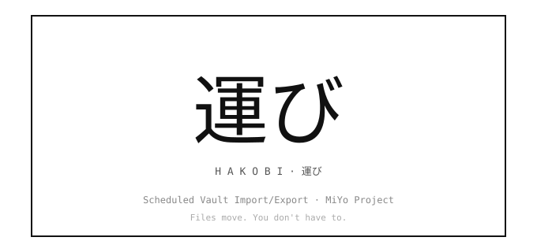

<p align="center">
  
</p>

# MiYo Hakobi — Obsidian File Ferry

Scheduled file ferry between your Obsidian vault and local filesystem paths. Voice memos / snippets / captures land in your inbox; folders / tags / notes export out to disk. Local-first, no daemon, no network surface.

> Part of the **MiYo** family. The plugin is referred to as **MiYo Hakobi** in the Obsidian community-plugin index and in the settings UI; "Hakobi" alone is used as a short form throughout this README and the source.

<p align="center">
  
</p>

## Why MiYo Hakobi?

Most "ferry the files" tooling either (a) lives outside Obsidian and has to be told about your vault separately (Hazel, launchd, cron), or (b) lives inside Obsidian and brings a cloud API along for the ride (Dropbox SDK, Google Drive OAuth, S3 keys). Hakobi is built around a different default:

- **No network surface.** No ports, no MCP server, no telemetry, no SDKs reaching out. Hakobi reads and writes locally-mounted filesystem paths.
- **Approval is the rule, not the run.** Creating a rule is the approval moment. After that, ferrying happens silently on each rule's `everyMinutes` schedule.
- **Per-device opt-in by default.** Newly-synced rules are **off** on every device that didn't create them. No surprise multi-device runs producing "Conflicted copy" files.
- **Metadata-only audit log.** Every run produces NDJSON entries with paths, operations, byte counts, and timings — but never note content, frontmatter values, or absolute home paths. The field allowlist is enforced at compile time.

If you want voice memos, capture-app exports, or Hazel-bait folders to land in your vault on a schedule — and the reverse for tagged or foldered exports — without inviting a cloud API, daemon, or telemetry, Hakobi is for you. External MCP access for your vault is the job of [MiYo Kado](https://github.com/MMoMM-org/miyo-kado).

## Features

- **Two rule types** — `import` (FS → vault) and `export` (vault → FS)
- **Three export sources** — `folder` (recursive vault subtree), `tag` (one or more tags with `any` / `all` match), `note` (single vault note)
- **Per-rule schedule** — each rule has its own `everyMinutes` cadence; one timer per enabled rule
- **Atomic writes** — destination is either the old version or the new version, never partial
- **Filename sanitization** — NUL bytes, path traversals, and empty names are refused at scan time
- **Stability check** — import waits for the source's `mtime` to stay quiet for `stabilityCheckMs` before picking it up; no half-written files
- **Cloud-sync placeholder safe** — stalled placeholders are skipped (logged as `io-timeout`) instead of force-materialized
- **Per-device toggle** — every rule has an `enabledOnThisDevice` flag stored in a non-synced sibling file
- **Six command-palette commands** — Run / Run-one / Dry-run for both directions
- **Audit log** — metadata-only NDJSON with monthly rotation, configurable retention and size cap
- **Dry-run mode** — every rule supports a dry-run flag; audit log records `would-write` / `would-skip` / `would-suffix` decisions instead of touching files
- **Status bar 運** — three-state indicator (idle / running / failed) with sticky-failed acknowledgement on click

## Documentation

| Document | Audience | Content |
|----------|----------|---------|
| [Installation](docs/installation.md) | Everyone | Community Plugins, BRAT, manual install |
| [Configuration Guide](docs/configuration.md) | Vault owners | Settings UI walkthrough — General, Import, Export subtabs |
| [Example Configurations](docs/example-configs.md) | Vault owners | Common rule recipes — voice memos, daily journal, tag bundles |
| [How It Works](docs/how-it-works.md) | Vault owners + contributors | Architecture, scheduler, audit log, lifecycle |
| [Commands](docs/commands.md) | Vault owners | The six command-palette entries and what they do |
| [Audit Log](docs/audit-log.md) | Vault owners | Format, retention, allowlist, NDJSON inspection examples |
| [Per-device Enablement](docs/per-device.md) | Vault owners | Why your synced rule didn't run; cross-device coordination model |
| [Troubleshooting / FAQ](docs/troubleshooting.md) | Vault owners | Common issues with concrete fixes |
| [Development Guide](docs/development.md) | Contributors | Build, test, lint, branching, architecture rules |
| [Privacy Policy](PRIVACY.md) | Everyone | Network surfaces, local storage, audit-log allowlist, supply chain |

## Quick Start

1. [Install the plugin](docs/installation.md)
2. Open **Settings → MiYo Hakobi**
3. The **General** subtab is selected by default — defaults are sensible; leave them be on first run
4. Switch to **Import** or **Export** and click **+ Add rule**
5. Pick source + destination, set `everyMinutes`, choose `copy` / `move` and `skip` / `suffix`, save
6. The status-bar 運 lights up when the first tick fires (within `everyMinutes`, plus a 3-second initial-run grace at plugin start)

For ready-made recipes — voice memos, journal export, tag-bundle publish — see [Example Configurations](docs/example-configs.md).

## Screenshots

**General subtab** — header section (plugin identity + hanko) plus global settings (per-file IO timeout, audit retention / size, stability check window) and the audit-log inspect / purge buttons.

<p align="center">
  
</p>

**Import subtab** — list of import rules. Each row shows the per-device toggle, name + summary, badges (`every Nm · copy/move · skip/suffix · mirror/flatten`), and an overflow `⋯` menu (Edit / Run now / Run dry-run / Delete).

<p align="center">
  
</p>

**Export subtab** — same shape as Import. Source-type can be `folder` (recursive vault subtree), `tag` (one or more tags with `any`/`all` match), or `note` (single vault note).

<p align="center">
  
</p>

## Roadmap

These are ideas under consideration, not commitments:

- **Active-note one-shot export** — a fuzzy-suggester command that lists configured export rules and runs the chosen one against the active note.
- **File-menu integration** — a right-click `Export via rule…` entry on notes in the file explorer (PRD F12, deferred from v0.1).
- **Settings import / export** — backup / restore of the rule definitions.

## Architecture

```
NodeFs → VaultIo → AuditLog + Rotation → RuleStore → DeviceStore
       → InFlightRegistry → ImportRunner + ExportRunner → StatusBar
       → Scheduler → SettingsTab → CommandRegistry
```

Layered, downward-only dependency flow. The **domain** layer (validation, sanitization) is pure — no `obsidian` import, no `node:fs` — so the entire validation model is testable without either runtime. See [How It Works](docs/how-it-works.md) for the full architecture.

## What Hakobi does NOT do

The following are explicitly **out of scope** for v0.1 and will probably never arrive:

- **No external network surface.** No ports, no MCP server, no inbound HTTP, no IPC socket. (External MCP access to your vault is the job of [MiYo Kado](https://github.com/MMoMM-org/miyo-kado).)
- **No native cloud-service APIs.** No Dropbox HTTP, no Google Drive REST, no S3, no SFTP, no WebDAV. Hakobi only reads and writes locally-mounted FS paths. Cloud-sync folders that mount as local paths (Dropbox, iCloud Drive, OneDrive, Google Drive's local mirror, Syncthing) are in scope as plain local paths — your trust decision.
- **No mobile support.** `isDesktopOnly: true`.
- **No per-execution approval prompts.** Creating the rule IS the approval.
- **No LLM / AI integration of any kind**, even passively.
- **No coupling to other MiYo components** (Tomo, Hashi, Kado, Seigyo) in v0.1.
- **No daemon / system-service mode.** Hakobi runs only while Obsidian is open.
- **No cron expressions.** Only `everyMinutes`.
- **No make-up runs** for ticks missed while Obsidian was closed or the machine was asleep.
- **No forced materialization** of cloud-sync placeholder files. Stalled placeholders are skipped + logged.
- **No telemetry, analytics, or crash reporting.** Ever. See [Privacy Policy](PRIVACY.md).

## Part of MiYo

Hakobi is part of [**MiYo**](https://github.com/MMoMM-org), a small family of Obsidian-adjacent tools focused on giving you control over what your assistants and your filesystem can see and do. Hakobi is the file-ferry component — the piece that moves bytes between your vault and disk on a schedule. Sibling components handle different concerns:

- [**MiYo Kado**](https://github.com/MMoMM-org/miyo-kado) — security-first MCP gateway.
- [**MiYo Tomo**](https://github.com/MMoMM-org/miyo-tomo) / [**MiYo Tomo Hashi**](https://github.com/MMoMM-org/miyo-tomo-hashi) — Claude Code AI workflows + Obsidian session UI.


### Open tracking

Live issues live in [GitHub Issues](https://github.com/MMoMM-org/miyo-hakobi/issues).

## Support

If MiYo Hakobi is useful to you and you want to help me keep building, you can support development via:

- [Buy Me a Coffee](https://ko-fi.com/mmomm)
- [GitHub Sponsors](https://github.com/sponsors/MMoMM-org)

Issues and pull requests are also very welcome.

## Contributing

Contributions are welcome. The short version:

1. **Open an issue first** for anything non-trivial (bugs, features, refactors) so we can align on scope before you invest time.
2. **Fork & branch** from `main`. Use a descriptive branch name (e.g. `fix/import-stability-check`, `feat/file-menu-export`).
3. **Keep changes focused** — one feature or one fix per PR. See [Development Guide](docs/development.md) for build, test, and lint commands.
4. **Tests & lint must pass** — run `npm run build`, `npm test`, and `npm run lint` before pushing.
5. **Conventional commits** — `feat:`, `fix:`, `docs:`, `refactor:`. Release notes are generated from commit history.
6. **Open a PR** against `main` and reference the issue. Small, reviewable diffs get merged fastest.

For security issues, please **do not** open a public issue — email **marcus@mmomm.org** instead.

## License

[MIT](LICENSE)
