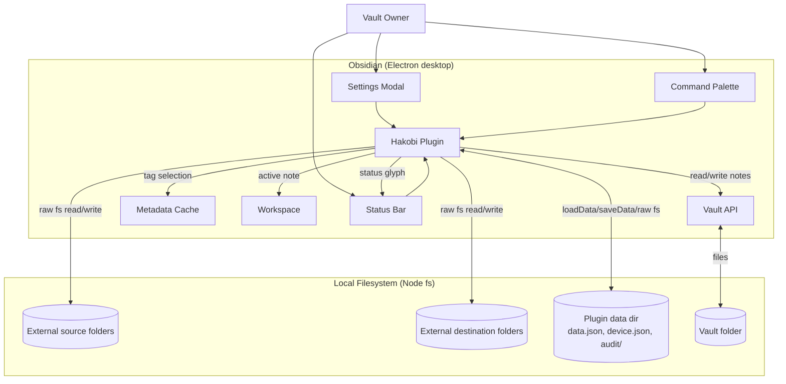
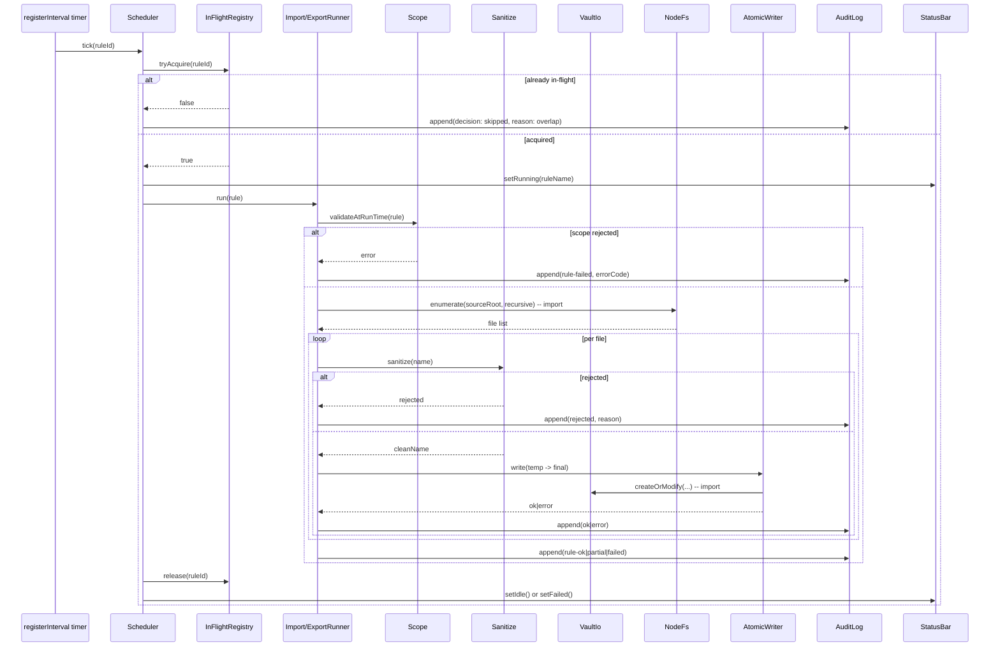
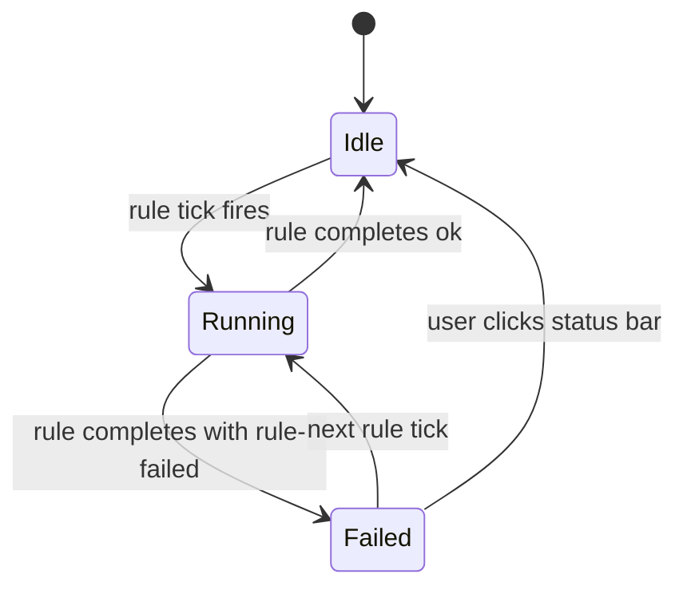

# Solution Design Document

## Validation Checklist

### CRITICAL GATES (Must Pass)

- [x] All required sections are complete
- [x] No [NEEDS CLARIFICATION] markers remain
- [x] Architecture pattern is clearly stated with rationale (layered modular monolith inside an Obsidian plugin)
- [x] **All architecture decisions confirmed by user** (ADR-1..12 all checked)
- [x] Every interface has specification

### QUALITY CHECKS (Should Pass)

- [x] All context sources are listed with relevance ratings
- [x] Project commands are discovered from actual project files
- [x] Constraints → Strategy → Design → Implementation path is logical
- [x] Every component in diagram has directory mapping
- [x] Error handling covers all error types
- [x] Quality requirements are specific and measurable
- [x] Component names consistent across diagrams
- [x] A developer could implement from this design
- [x] Implementation examples use real types (verified against types/index.ts as it stands and as it will evolve)
- [x] Complex queries include traced walkthroughs (filename sanitization + collision suffix)

---

## Output Schema

(See SDD template — preserved verbatim.)

---

## Constraints

CON-1 **Local-first, no network surface (Constitution L1 Privacy):** No HTTP server, no outbound HTTP, no telemetry, no analytics, no version-update pings. Code must contain no `fetch`, `XMLHttpRequest`, or third-party SDK that pings home. CI lint check enforces this.

CON-2 **Default-deny scope (Constitution L1 Privacy):** No file is touched unless an explicit user-created rule covers it; rule existence does not extend access beyond the declared subtree. All path resolution real-paths through `realpath()` and rejects anything escaping the declared root.

CON-3 **Metadata-only audit (Constitution L2 Privacy):** Audit-log entries restricted to a closed allowlist of fields (timestamps, paths, ops, decisions, error codes, byte counts, durations). No file bytes, frontmatter values, or absolute home-directory paths.

CON-4 **No daemon — Obsidian-only runtime:** Scheduler runs only while the plugin is loaded inside an open Obsidian instance. All timers cleaned up on `onunload`. Missed ticks during sleep / closed app are NOT made up.

CON-5 **Desktop-only (`isDesktopOnly: true` in manifest):** Mobile out of scope; raw `fs/promises` is acceptable everywhere outside the vault. Vault paths always go through the Vault API.

CON-6 **No coupling to other MiYo components in v0.1:** Hakobi must function with no MiYo siblings present. No imports from Tomo / Hashi / Kado / Seigyo / Kokoro packages. Forward-compatibility tickets only — no integration code.

CON-7 **TypeScript strict, no `any`:** `tsconfig.json` has `"strict": true`. Public functions have explicit return types. Domain primitives are nominal types where it adds clarity (`RuleId`, `AbsolutePath`).

CON-8 **TDD discipline (per `src/CLAUDE.md`):** No production code without a failing test first. Coverage targets: every public function tested; happy path + at least one error path per function.

CON-9 **File size budget (Constitution L2 Code Quality):** Source files cap at ~300–500 LOC of dense logic before refactor. Settings UI sections may be larger (declarative DOM trees) but should still be split per concern.

CON-10 **No ESLint disables without justification (Constitution L2 Code Quality):** `eslint-plugin-obsidianmd` rules block at zero errors; `eslint-disable` comments require an inline `// reason: …` justification.

## Implementation Context

**IMPORTANT**: You MUST read and analyze ALL listed context sources to understand constraints, patterns, and existing architecture.

### Required Context Sources

#### Documentation Context
```yaml
- doc: docs/XDD/specs/001-v0-1/requirements.md
  relevance: CRITICAL
  why: "Source of truth for all v0.1 functional requirements (F1–F12) and acceptance criteria."

- doc: docs/XDD/specs/001-v0-1/README.md
  relevance: HIGH
  why: "Decision log capturing the resolved shape decisions and PRD-review notes."

- doc: ~/Kouzou/projects/miyo/miyo-constitution.md
  relevance: CRITICAL
  why: "L1/L2 rules that bind privacy, security, default-deny, metadata-only audit, code quality, performance."

- doc: ~/Kouzou/projects/miyo/miyo-architecture.md
  relevance: HIGH
  why: "Hakobi's role in the MiYo ecosystem; scope boundary vs Kado (only inbound surface) and Hashi."

- doc: src/CLAUDE.md
  relevance: HIGH
  why: "TDD rules, TypeScript rules, Obsidian plugin patterns (lifecycle cleanup via register*, no innerHTML)."

- doc: test/CLAUDE.md
  relevance: HIGH
  why: "Test naming, mock conventions, test vault location, lifecycle cleanup assertions via `_runCleanup()`."

- doc: PRIVACY.md
  relevance: HIGH
  why: "Will be updated in PLAN to declare network surfaces (none), local data, audit-log scope, symlink refusal."
```

#### Code Context
```yaml
- file: src/main.ts
  relevance: CRITICAL
  why: "Plugin entry; will be expanded to wire Scheduler, StatusBar, RuleStore, DeviceStore, AuditLog, command registry."

- file: src/settings/SettingsTab.ts
  relevance: CRITICAL
  why: "Current placeholder; will be replaced by a multi-section settings tab."

- file: src/types/index.ts
  relevance: CRITICAL
  why: "Currently holds `PluginSettings` with `exampleSetting`; will be replaced by Rule discriminated union + DeviceState + GlobalSettings types."

- file: test/__mocks__/obsidian.ts
  relevance: CRITICAL
  why: "Already provides Vault API mocks (read/cachedRead/create/modify/delete/adapter), Setting/Toggle/Dropdown/Button primitives, Plugin._runCleanup() for lifecycle assertions, createMockTFile/createMockCachedMetadata factories. Tests will rely on this surface."

- file: package.json
  relevance: HIGH
  why: "Available scripts (`npm run build`, `test`, `lint`, `dev`, `test:live`), peer dep on Obsidian ≥1.5.7."

- file: manifest.json
  relevance: HIGH
  why: "`isDesktopOnly: true`; min app version 1.5.7; plugin id `miyo-hakobi`."

- file: tsconfig.json / tsconfig.test.json
  relevance: MEDIUM
  why: "Strict mode + path mapping for `settings/`, `types/` imports."

- file: eslint.config.mts
  relevance: MEDIUM
  why: "obsidianmd rules; CI enforces zero errors."

- file: esbuild.config.mjs
  relevance: MEDIUM
  why: "Bundle config; obsidian externalised; entry `src/main.ts`."
```

#### External APIs

N/A — Hakobi v0.1 has no external network integrations.

### Implementation Boundaries

- **Must Preserve**:
  - Plugin id `miyo-hakobi` (manifest stable API).
  - `isDesktopOnly: true`.
  - `src/main.ts` thin-lifecycle pattern (wiring only; no business logic).
  - `register*` cleanup discipline so `Plugin._runCleanup()` tests pass.
- **Can Modify**:
  - All of `src/settings/SettingsTab.ts` (will be rebuilt).
  - All of `src/types/index.ts` (placeholder schema replaced by domain types).
  - `package.json` deps (additions allowed; bounded versions per Constitution L1 Dependencies).
- **Must Not Touch**:
  - `_inbox/` and `_outbox/` directories — Claude-coordination handoff buffers, gitignored.
  - `.obsidian/` inside `test/Hakobi/` — managed by hot-reload.
  - `~/Kouzou/` from this session — Kouzou-hosted Claude session owns those git ops.

### External Interfaces

#### System Context Diagram



#### Interface Specifications

```yaml
# Inbound interfaces (what calls Hakobi)
inbound:
  - name: "Obsidian Settings UI"
    type: in-process method calls
    format: TypeScript class instances (PluginSettingTab.display())
    authentication: N/A (local user)
    data_flow: "User configures rules, toggles enable, edits global settings, views audit log."

  - name: "Obsidian Command Palette"
    type: in-process callbacks
    format: registered command handlers (addCommand)
    authentication: N/A
    data_flow: "User triggers Run / Run-select / Export-this-note / dry-run variants."

  - name: "Obsidian Lifecycle"
    type: in-process method calls
    format: Plugin.onload() / Plugin.onunload()
    authentication: N/A
    data_flow: "Plugin start/stop signals; all timers and DOM listeners cleaned up via register* helpers."

# Outbound interfaces (what Hakobi calls)
outbound:
  - name: "Obsidian Vault API"
    type: in-process
    format: TypeScript (app.vault.read / cachedRead / create / modify / delete / getMarkdownFiles / adapter.stat / adapter.exists / adapter.rename)
    authentication: N/A
    data_flow: "Vault note read/write/list, vault folder enumeration, file existence/stat for collision check."
    criticality: CRITICAL

  - name: "Obsidian Metadata Cache"
    type: in-process
    format: TypeScript (app.metadataCache.getFileCache, getAllTags)
    authentication: N/A
    data_flow: "Tag-based note selection for export-by-tag rules."
    criticality: HIGH

  - name: "Node fs/promises"
    type: in-process
    format: Node fs API
    authentication: N/A
    data_flow: "Read from / write to external local FS paths only (never the vault)."
    criticality: CRITICAL

# Data interfaces (persistent state)
data:
  - name: "Plugin data.json"
    type: JSON file
    connection: Obsidian loadData/saveData
    data_flow: "Rule definitions (Sync-replicated), global settings (timeout, retention), schema version."

  - name: "Plugin device.json"
    type: JSON file
    connection: Obsidian adapter (vault-relative path under plugin data dir)
    data_flow: "Per-device enabledOnThisDevice flags (NOT Sync-replicated by design — see ADR-2)."

  - name: "Plugin audit/YYYY-MM.ndjson"
    type: NDJSON append-only files
    connection: Node fs/promises (append) + adapter.read for viewer
    data_flow: "One line per audit entry (rule-level or per-file). Rotated monthly + on size cap."
```

### Cross-Component Boundaries

N/A — single-component Obsidian plugin in v0.1.

### Project Commands

Discovered from `package.json`:

```bash
# Core commands
Install:    npm install
Dev:        npm run dev          # esbuild watch (esbuild.config.mjs, no production flag)
Build:      npm run build        # tsc --noEmit + esbuild production
Typecheck:  npm run typecheck    # tsc --noEmit only
Test:       npm test             # vitest run
Test watch: npm run test:watch
Coverage:   npm run test:coverage
Test (live):npm run test:live    # vitest with vitest.live.config.ts (vault-backed)
Lint:       npm run lint         # eslint .
Lint fix:   npm run lint:fix
Audit:      npm run audit        # npm audit --audit-level=high --omit=dev
```

No DB / migrations / seed commands — file-based persistence only.

## Solution Strategy

- **Architecture Pattern: Layered modular monolith inside an Obsidian plugin.** Five layers: (1) Plugin lifecycle (`main.ts`), (2) UI (settings tab, status bar, command registry), (3) Domain (rules, scheduler, runners), (4) Persistence (rule store, device store, audit log), (5) Infrastructure adapters (vault I/O, node fs, sanitization, scope checks). Dependencies flow downward only: UI → Domain → Persistence → Infrastructure. No upward dependencies.
- **Integration Approach:** Hakobi runs entirely in-process inside Obsidian's renderer. The Vault API is the only path into the vault; raw `fs/promises` is the only path to external paths. The two never cross. The settings tab and command palette are the only user surfaces. Status bar is read-only state output. No external network.
- **Justification:** v0.1 has no scaling demands — single user, single process, single vault. A modular monolith costs nothing in complexity, keeps cognitive load tractable for AI-assisted reviews (Constitution L2 Code Quality), and lets each layer be independently tested with the existing `test/__mocks__/obsidian.ts` mock. The layered breakdown enforces that domain logic can be unit-tested without an Obsidian or fs runtime, satisfying Constitution L1 Code Quality ("clean separation between core logic and AI-orchestration glue, so domain behaviour is testable without an AI in the loop" — read here as "without Obsidian in the loop").
- **Key Decisions:** (1) Hybrid persistence — rules in `data.json`, per-device enable bits in sibling `device.json` (PRD F8). (2) Per-rule scheduler with one timer per rule registered via `registerInterval`. (3) Pure-function sanitizer + scope checker so they're trivially unit-tested. (4) NDJSON append-only audit log in plugin data dir, rotated monthly. (5) Discriminated union for `Rule` (one type per direction × selector). (6) Status bar = single Obsidian-styled element, kanji 運 + color states + hover tooltip.

## Building Block View

### Components

```mermaid
graph TB
    subgraph Lifecycle
        Main[main.ts<br/>HakobiPlugin]
    end

    subgraph UI
        SettingsTab[SettingsTab<br/>+ HeaderSection]
        Subtabs[GeneralSubtab<br/>ImportSubtab<br/>ExportSubtab]
        StatusBar[StatusBar]
        CommandRegistry[CommandRegistry]
        RuleEditor[Rule editors<br/>Import/Export]
    end

    subgraph Domain
        Scheduler[Scheduler]
        ImportRunner[ImportRunner]
        ExportRunner[ExportRunner]
        InFlight[InFlightRegistry]
        Sanitize[sanitize.ts]
        Scope[scope.ts]
        RuleId[ruleId.ts]
    end

    subgraph Persistence
        RuleStore[RuleStore<br/>data.json]
        DeviceStore[DeviceStore<br/>device.json]
        AuditLog[AuditLog<br/>NDJSON]
        Rotation[Rotation]
    end

    subgraph Infrastructure
        VaultIo[VaultIo]
        NodeFs[NodeFs<br/>+ timeout]
        PathSafe[PathSafe<br/>expansion + traversal]
        AtomicWriter[AtomicWriter]
    end

    Main --> SettingsTab
    Main --> StatusBar
    Main --> CommandRegistry
    Main --> Scheduler
    Main --> RuleStore
    Main --> DeviceStore
    Main --> AuditLog

    SettingsTab --> Subtabs
    Subtabs --> RuleEditor
    Subtabs --> RuleStore
    Subtabs --> DeviceStore
    Subtabs --> AuditLog

    CommandRegistry --> Scheduler

    Scheduler --> ImportRunner
    Scheduler --> ExportRunner
    Scheduler --> InFlight
    Scheduler --> StatusBar

    ImportRunner --> NodeFs
    ImportRunner --> VaultIo
    ImportRunner --> Sanitize
    ImportRunner --> Scope
    ImportRunner --> AtomicWriter
    ImportRunner --> AuditLog

    ExportRunner --> VaultIo
    ExportRunner --> NodeFs
    ExportRunner --> Scope
    ExportRunner --> AtomicWriter
    ExportRunner --> AuditLog

    AuditLog --> Rotation

    RuleEditor --> Scope
    RuleEditor --> RuleId
    RuleEditor --> PathSafe

    AtomicWriter --> NodeFs
    AtomicWriter --> VaultIo

    VaultIo -.app.vault.-> Vault[(Vault)]
    NodeFs -.fs/promises.-> ExternalFs[(External FS)]
```

### Directory Map

**Component**: `miyo-hakobi` (single Obsidian plugin)

```
.
├── src/
│   ├── main.ts                            # MODIFY: HakobiPlugin lifecycle wiring (Scheduler, stores, UI)
│   ├── settings/
│   │   ├── SettingsTab.ts                 # MODIFY: replace placeholder; renders header + subtab row + active subtab body
│   │   ├── HeaderSection.ts               # NEW: top-of-tab plugin name, tagline, author/docs/funding links from manifest
│   │   ├── subtabs/
│   │   │   ├── GeneralSubtab.ts           # NEW: global settings, "Show audit log" + "Purge audit log now" buttons
│   │   │   ├── ImportSubtab.ts            # NEW: import-rules list + add/edit
│   │   │   └── ExportSubtab.ts            # NEW: export-rules list + add/edit
│   │   └── editor/
│   │       ├── ImportRuleEditor.ts        # NEW: inline editor for an import rule
│   │       └── ExportRuleEditor.ts        # NEW: inline editor for an export rule (folder|tag|note)
│   ├── domain/
│   │   ├── rule.ts                        # NEW: Rule discriminated union, defaults, validation
│   │   ├── sanitize.ts                    # NEW: pure filename sanitization pipeline
│   │   ├── scope.ts                       # NEW: default-deny scope checks (loop, vault root, .obsidian, plugin dir, symlink)
│   │   └── ruleId.ts                      # NEW: UUID v4 generation (crypto.randomUUID)
│   ├── scheduler/
│   │   ├── Scheduler.ts                   # NEW: per-rule timers via registerInterval; dispatches to runners
│   │   └── InFlightRegistry.ts            # NEW: tracks running rule IDs for overlap-skip
│   ├── runner/
│   │   ├── ImportRunner.ts                # NEW: executes one import rule run
│   │   ├── ExportRunner.ts                # NEW: executes one export rule run (folder|tag|note dispatch)
│   │   └── AtomicWriter.ts                # NEW: temp-then-rename helper (vault and FS)
│   ├── audit/
│   │   ├── AuditLog.ts                    # NEW: NDJSON append + iterator + purge
│   │   ├── AuditEntry.ts                  # NEW: closed types for entries; serialization
│   │   └── Rotation.ts                    # NEW: monthly + size-cap rotation policy
│   ├── fs/
│   │   ├── NodeFs.ts                      # NEW: fs/promises wrapper with global timeout, placeholder detection
│   │   └── PathSafe.ts                    # NEW: expansion (~, $HOME, %USERPROFILE%), realpath, traversal checks
│   ├── vault/
│   │   └── VaultIo.ts                     # NEW: app.vault.* wrapper (read/write/list/by-tag/active-file)
│   ├── ui/
│   │   ├── StatusBar.ts                   # NEW: kanji 運 status-bar element + state machine
│   │   ├── CommandRegistry.ts             # NEW: registers all 7 command-palette commands
│   │   └── Notices.ts                     # NEW: thin helpers for transient/persistent Notices
│   └── types/
│       └── index.ts                       # MODIFY: export Rule | DeviceState | GlobalSettings | AuditEntry types
├── test/
│   ├── domain/
│   │   ├── sanitize.test.ts               # NEW: every sanitization rule has a test
│   │   ├── scope.test.ts                  # NEW: every default-deny case has a test
│   │   └── rule.test.ts                   # NEW: schema/defaults/validation tests
│   ├── scheduler/
│   │   ├── Scheduler.test.ts              # NEW: timer registration/cleanup, overlap skip
│   │   └── InFlightRegistry.test.ts       # NEW
│   ├── runner/
│   │   ├── ImportRunner.test.ts           # NEW: copy/move/skip/suffix/dry-run; symlink refusal; sanitization rejection
│   │   ├── ExportRunner.test.ts           # NEW: folder/tag/note dispatch; flatten on/off
│   │   └── AtomicWriter.test.ts           # NEW
│   ├── audit/
│   │   ├── AuditLog.test.ts               # NEW: append, read-back, purge
│   │   └── Rotation.test.ts               # NEW: size and age caps
│   ├── fs/
│   │   ├── NodeFs.test.ts                 # NEW: timeout, placeholder skip
│   │   └── PathSafe.test.ts               # NEW: expansion, traversal rejection
│   ├── vault/
│   │   └── VaultIo.test.ts                # NEW
│   ├── settings/
│   │   ├── SettingsTab.test.ts            # NEW: header presence, subtab switching, active-subtab indicator
│   │   ├── HeaderSection.test.ts          # NEW: links derived from manifest, no hard-coded URLs
│   │   ├── subtabs/
│   │   │   ├── GeneralSubtab.test.ts      # NEW: global setting persistence, "Show audit log" button opens file, purge confirm flow
│   │   │   ├── ImportSubtab.test.ts       # NEW: empty state, add-rule flow, list rendering
│   │   │   └── ExportSubtab.test.ts       # NEW
│   │   └── editor/
│   │       ├── ImportRuleEditor.test.ts   # NEW
│   │       └── ExportRuleEditor.test.ts   # NEW
│   ├── ui/
│   │   ├── StatusBar.test.ts              # NEW: state transitions, aria-label, click target
│   │   └── CommandRegistry.test.ts        # NEW
│   ├── lifecycle/
│   │   └── unload.test.ts                 # NEW: plugin._runCleanup() leaves no timers/listeners
│   └── live/                              # OPTIONAL: vault-backed end-to-end (npm run test:live)
│       └── (created later in PLAN if needed)
```

### Interface Specifications

#### Interface Documentation References

```yaml
interfaces:
  - name: "Obsidian Plugin API"
    doc: "https://docs.obsidian.md/Plugins"
    relevance: CRITICAL
    sections: [Plugin, PluginSettingTab, Vault, Workspace, MetadataCache, addCommand, addStatusBarItem, registerInterval]
    why: "All UI/lifecycle/IO touchpoints route through these APIs."

  - name: "Node fs/promises"
    doc: "https://nodejs.org/api/fs.html#promises-api"
    relevance: CRITICAL
    sections: [readdir, readFile, writeFile, rename, unlink, lstat, realpath, mkdir, rm]
    why: "All external-FS reads/writes use this surface; lstat + realpath enforce default-deny scope."
```

#### Data Storage Changes

No SQL database — JSON files only.

```yaml
# data.json (Sync-replicated by Obsidian Sync if user enables it for plugin settings)
{
  "schemaVersion": 1,
  "rules": [
    { "id": "<uuid>", "direction": "import", ... },
    { "id": "<uuid>", "direction": "export", "sourceType": "folder", ... }
  ],
  "globalSettings": {
    "perFileTimeoutMs": 10000,
    "auditRetentionDays": 90,
    "auditMaxBytes": 10485760,
    "stabilityCheckMs": 2000
  }
}

# device.json (NOT replicated — sibling file, lives in plugin data dir alongside data.json)
# Path resolution: app.vault.adapter.getFullPath() of <pluginDataDir>/device.json
{
  "schemaVersion": 1,
  "deviceId": "<uuid generated on first run, persisted>",
  "ruleEnablement": {
    "<rule-uuid>": true,
    "<rule-uuid>": false
  }
}

# audit/YYYY-MM.ndjson (NOT replicated — sibling files, plugin data dir)
# One JSON object per line, newline-terminated, append-only.
# See "Application Data Models" → AuditEntry below for shape.

schema_doc: "Inline above — no separate schema file."
migration_scripts: "Schema versions handled in RuleStore/DeviceStore (incremental migrators if needed)."
```

#### Internal API Changes

No HTTP endpoints — all interfaces are TypeScript method calls. The "API" is the public method surface of each domain class. See **Application Data Models** for entity shapes.

#### Application Data Models

```typescript
// src/domain/rule.ts — Rule discriminated union

type RuleId = string & { readonly __brand: "RuleId" };
type AbsolutePath = string & { readonly __brand: "AbsolutePath" };
type VaultRelativePath = string & { readonly __brand: "VaultRelativePath" };

interface RuleBase {
  id: RuleId;
  name: string;
  everyMinutes: number;        // ≥ 1
  action: "copy" | "move";
  onCollision: "skip" | "suffix";
  flattenOnTarget: boolean;
  dryRun: boolean;
}

interface ImportRule extends RuleBase {
  direction: "import";
  sourcePath: AbsolutePath;            // post-expansion (~, $HOME, %USERPROFILE%)
  destinationVaultPath: VaultRelativePath;
}

interface ExportFolderRule extends RuleBase {
  direction: "export";
  sourceType: "folder";
  sourceVaultPath: VaultRelativePath;
  destinationPath: AbsolutePath;
}

interface ExportTagRule extends RuleBase {
  direction: "export";
  sourceType: "tag";
  tags: string[];                       // each starts with "#"; nested tags supported
  tagMatch: "any" | "all";
  destinationPath: AbsolutePath;
}

interface ExportNoteRule extends RuleBase {
  direction: "export";
  sourceType: "note";
  sourceVaultNotePath: VaultRelativePath;
  destinationPath: AbsolutePath;
}

type ExportRule = ExportFolderRule | ExportTagRule | ExportNoteRule;
type Rule = ImportRule | ExportRule;

// src/audit/AuditEntry.ts — Audit log shape (closed allowlist)

type Direction = "import" | "export";
type Operation =
  | "copy" | "move"
  | "skip" | "suffix" | "rejected" | "error"
  | "would-write" | "would-skip" | "would-suffix"
  | "skipped";  // overlap

type ErrorCode =
  | "source-not-found" | "destination-not-writable" | "destination-parent-missing"
  | "destination-name-conflicts-note"
  | "symlink-refused" | "subdir-is-symlink" | "source-is-symlink"
  | "loop-refused" | "forbidden-path"
  | "sanitization-rejected" | "sanitization-empty"
  | "housekeeping-file"
  | "io-timeout" | "source-modified" | "source-vanished"
  | "disk-full" | "permission-denied"
  | "overlap"
  | "unknown";

type Decision =
  | "ok"           // file transferred successfully
  | "skipped"      // file not transferred (collision skip / overlap / etc.)
  | "rejected"     // refused by sanitization or scope
  | "error"        // transferred attempt failed
  | "would-write" | "would-skip" | "would-suffix" // dry-run
  | "rule-ok" | "rule-failed" | "rule-partial";   // rule-level entries

interface AuditEntry {
  timestamp: string;                  // ISO 8601 UTC
  ruleId: RuleId;
  ruleName: string;
  direction: Direction;
  operation: Operation;
  sourcePathRelative?: string;        // relative to rule source root; never absolute
  destinationPathRelative?: string;   // relative to rule destination root
  decision: Decision;
  errorCode?: ErrorCode;
  bytesTransferred?: number;
  durationMs?: number;
}

// src/types/index.ts — Top-level persisted shapes

interface PluginData {
  schemaVersion: 1;
  rules: Rule[];
  globalSettings: GlobalSettings;
}

interface GlobalSettings {
  perFileTimeoutMs: number;     // F11; default 10000
  auditRetentionDays: number;   // F5; default 90
  auditMaxBytes: number;        // F5; default 10485760 (10 MB)
  stabilityCheckMs: number;     // mtime-stable window; default 2000
}

interface DeviceState {
  schemaVersion: 1;
  deviceId: string;             // UUID generated on first run, persisted
  ruleEnablement: Record<RuleId, boolean>;
}
```

#### Integration Points

```yaml
# Inter-component communication (within Hakobi)
- from: Scheduler
  to: ImportRunner / ExportRunner
  protocol: in-process method call
  data_flow: "Run a single rule once. Result is void; side effects go to AuditLog and StatusBar."

- from: Scheduler
  to: StatusBar
  protocol: in-process method call
  data_flow: "State updates: idle → running '<rule>' → idle/last-run-failed."

- from: SettingsTab
  to: RuleStore / DeviceStore
  protocol: in-process method call
  data_flow: "Load/save rule definitions, toggle per-device enablement."

# External (third-party) integration
External_None: "Hakobi v0.1 has no third-party services."
```

### Implementation Examples

#### Example: Filename sanitization pipeline (F4)

**Why this example:** The sanitization rules are the single most security-sensitive piece of v0.1 — a bug here lets a malicious source filename traverse out of the rule destination. The pipeline is small, pure, and unit-testable; an exact reference implementation removes ambiguity. **Obsidian itself rejects a stricter set of characters in note basenames than the OS does** (`* " \ / < > : | ?`), so the pipeline must replace those before any vault write — otherwise `app.vault.create()` throws and the run silently regresses.

```typescript
// src/domain/sanitize.ts

const CONTROL_CHARS = /[\x00-\x1F\x7F]/g;
// Obsidian rejects these characters in note basenames (separate from OS-level rules).
// Replace with `_` so the file still lands but with a vault-legal name.
const OBSIDIAN_INVALID = /[*"\\/<>:|?]/g;
const RESERVED_WIN = /^(CON|PRN|AUX|NUL|COM[1-9]|LPT[1-9])(\..*)?$/i;
const HOUSEKEEPING = new Set([
  ".DS_Store", "Thumbs.db", "desktop.ini", ".localized",
  ".AppleDouble", "$RECYCLE.BIN", "System Volume Information",
]);

const MAX_SEGMENT_BYTES = 255;
const MAX_TOTAL_BYTES = 1024;

export type SanitizeResult =
  | { ok: true; name: string }
  | { ok: false; reason: "sanitization-rejected" | "sanitization-empty" | "housekeeping-file" };

export function sanitizeFilename(input: string): SanitizeResult {
  // 1. Reject NUL anywhere (cannot be sanitized away safely)
  if (input.includes("\0")) return { ok: false, reason: "sanitization-rejected" };

  // 2. Take basename only — strip path separators, traversal segments
  const last = input.split(/[\\/]/).pop() ?? "";
  if (last.includes("..")) return { ok: false, reason: "sanitization-rejected" };

  // 3. Skip OS housekeeping files
  if (HOUSEKEEPING.has(last)) return { ok: false, reason: "housekeeping-file" };

  // 4. Strip control chars
  let name = last.replace(CONTROL_CHARS, "");

  // 5. Replace Obsidian-invalid chars (`* " \ / < > : | ?`) with `_`
  //    Obsidian's note-create API rejects these even when the underlying OS allows them.
  name = name.replace(OBSIDIAN_INVALID, "_");

  // 6. Trim leading/trailing dots and whitespace
  name = name.replace(/^[.\s]+|[.\s]+$/g, "");

  // 7. Rename Windows-reserved names
  if (RESERVED_WIN.test(name)) name = `${name}-file`;

  // 8. Empty after sanitization → reject
  if (name.length === 0) return { ok: false, reason: "sanitization-empty" };

  // 9. Length caps (UTF-8 byte length, not char length)
  const enc = new TextEncoder();
  if (enc.encode(name).byteLength > MAX_SEGMENT_BYTES) {
    return { ok: false, reason: "sanitization-rejected" };
  }
  if (enc.encode(name).byteLength > MAX_TOTAL_BYTES) {
    return { ok: false, reason: "sanitization-rejected" };
  }

  return { ok: true, name };
}
```

**Traced walkthrough:**

| Input | Step that triggers | Result |
|-------|--------------------|--------|
| `voice-memo-2026-04-30.m4a` | passes all steps | `{ ok: true, name: "voice-memo-2026-04-30.m4a" }` |
| `../../.obsidian/plugins/x` | step 2 (`..` in last segment) | `{ ok: false, reason: "sanitization-rejected" }` |
| `note\0.txt` | step 1 (NUL byte) | `{ ok: false, reason: "sanitization-rejected" }` |
| `.DS_Store` | step 3 (housekeeping allowlist) | `{ ok: false, reason: "housekeeping-file" }` |
| `meeting: notes ?.md` | step 5 (Obsidian-invalid chars) → `meeting_ notes _.md` → step 6 trims | `{ ok: true, name: "meeting_ notes _.md" }` |
| `report<draft>v2.md` | step 5 → `report_draft_v2.md` | `{ ok: true, name: "report_draft_v2.md" }` |
| `   ` (spaces only) | step 6 → name becomes empty → step 8 | `{ ok: false, reason: "sanitization-empty" }` |
| `CON.txt` | step 7 (Windows reserved) | `{ ok: true, name: "CON.txt-file" }` |
| `🎙️ recording.m4a` | passes; UTF-8 bytes within cap | `{ ok: true, name: "🎙️ recording.m4a" }` |
| 600-byte filename | step 9 (byte cap) | `{ ok: false, reason: "sanitization-rejected" }` |

#### Example: Collision-suffix algorithm (F1, F2)

**Why this example:** "Lowest available numeric suffix" is easy to misread as "incrementing counter" (which would race with concurrent runs). The reference algorithm is a probe loop bounded by a max attempt count.

```typescript
// src/runner/AtomicWriter.ts (excerpt)

const MAX_SUFFIX_ATTEMPTS = 999;

export async function resolveCollisionName(
  destinationDir: string,
  baseName: string,
  exists: (path: string) => Promise<boolean>,
): Promise<{ ok: true; finalName: string } | { ok: false; reason: "too-many-collisions" }> {
  if (!(await exists(`${destinationDir}/${baseName}`))) {
    return { ok: true, finalName: baseName };
  }

  const dot = baseName.lastIndexOf(".");
  const stem = dot > 0 ? baseName.slice(0, dot) : baseName;
  const ext = dot > 0 ? baseName.slice(dot) : "";

  for (let i = 1; i <= MAX_SUFFIX_ATTEMPTS; i++) {
    const candidate = `${stem}-${i}${ext}`;
    if (!(await exists(`${destinationDir}/${candidate}`))) {
      return { ok: true, finalName: candidate };
    }
  }
  return { ok: false, reason: "too-many-collisions" };
}
```

**Traced walkthrough:**

| Existing files in dir | Input baseName | Probe sequence | Result |
|-----------------------|----------------|----------------|--------|
| (empty) | `note.md` | `note.md` (no exists) | `{ ok: true, finalName: "note.md" }` |
| `note.md` | `note.md` | `note.md` exists → `note-1.md` (no exists) | `{ ok: true, finalName: "note-1.md" }` |
| `note.md`, `note-1.md` | `note.md` | `note.md` exists → `note-1.md` exists → `note-2.md` no | `{ ok: true, finalName: "note-2.md" }` |
| `README` (no ext) | `README` | `README` exists → `README-1` no | `{ ok: true, finalName: "README-1" }` |
| 1000+ collisions | `note.md` | exhausts attempts | `{ ok: false, reason: "too-many-collisions" }` (rule-level error) |

## Runtime View

### Primary Flow

#### Primary Flow: Scheduled rule tick (import or export)



### Error Handling

| Error class | Handler | User-visible behavior |
|-------------|---------|-----------------------|
| Validation (rule save time): missing fields, invalid path, loop detected, forbidden destination | `ImportRuleEditor` / `ExportRuleEditor` | Inline field-level error; Save button disabled until valid. |
| Scope (run time): symlink refused, traversal attempt, forbidden path | `ImportRunner` / `ExportRunner` via `scope.ts` | Per-file `decision: rejected` audit entry; rule continues with siblings; rule-level `rule-partial` if any rejection occurred. |
| Sanitization rejection | `ImportRunner` via `sanitize.ts` | Per-file `decision: rejected` audit entry; rule continues. |
| IO timeout, placeholder stall | `NodeFs` (Promise.race with timeout) | Per-file `decision: skipped, errorCode: io-timeout`; rule continues. |
| Source vanished (ENOENT mid-iteration) | `ImportRunner` / `ExportRunner` | Per-file `decision: skipped, errorCode: source-vanished`; rule continues. |
| Source modified mid-read (size mismatch) | `ImportRunner` | Per-file `decision: skipped, errorCode: source-modified`; rule continues. |
| Disk full (ENOSPC) | `AtomicWriter` | Per-file `decision: error, errorCode: disk-full`; rule-level fails; status bar → error color. |
| Source path missing (rule-level) | `ImportRunner` / `ExportRunner` | Single rule-level `rule-failed, errorCode: source-not-found`; no per-file entries; status bar → error color. |
| Destination parent missing | runners | Rule-level `rule-failed, errorCode: destination-parent-missing`; status bar → error color. |
| Overlap with previous run | `Scheduler` via `InFlightRegistry` | One audit entry `decision: skipped, errorCode: overlap`; no run dispatched. |
| Unknown / unhandled | runners (catch-all) | `decision: error, errorCode: unknown`; rule-level fail; logged with stack trace to console (NOT to audit). |
| Plugin unload mid-run | `Scheduler.shutdown()` | In-flight runs are NOT cancelled; they complete naturally because each operates on a snapshot of files/rules. Pending audit writes are awaited up to a 2 s grace window. |

### Complex Logic

#### Algorithm: ImportRunner.run(rule)

```
INPUT: rule (ImportRule), nowFn, sanitize, scope, nodeFs, vaultIo, atomicWriter, auditLog, globalSettings
OUTPUT: void (audit log entries are the side effect)

1. VALIDATE rule at run time:
   - scope.realPathInsideDeclaredRoot(rule.sourcePath) — refuse if escapes
   - scope.notSymlink(rule.sourcePath) — refuse if symlink
   - scope.notForbiddenVaultDestination(rule.destinationVaultPath) — refuse if vault root / .obsidian / plugin data dir
   IF any fails: append rule-failed entry; RETURN.

2. ENUMERATE source subtree recursively:
   - Walk rule.sourcePath via fs.readdir + fs.lstat
   - Refuse symlinked subdirectories (subdir-is-symlink)
   - Skip housekeeping files (HOUSEKEEPING set)
   - Apply stability check: file mtime unchanged for ≥ globalSettings.stabilityCheckMs
   - Build (sourceFile, sourceRelativePath) tuples

3. FOR EACH (sourceFile, sourceRel) tuple:
   a. SANITIZE basename(sourceFile)
      - on rejection: append rejected entry; CONTINUE.
   b. COMPUTE destination subpath:
      - rule.flattenOnTarget = true → destSubpath = sanitizedName
      - rule.flattenOnTarget = false → destSubpath = dirname(sourceRel) + "/" + sanitizedName
   c. RESOLVE COLLISION:
      - rule.onCollision = "skip" → if vault file exists at destSubpath, append skip entry; CONTINUE.
      - rule.onCollision = "suffix" → resolveCollisionName(destSubpath); use returned name.
   d. IF rule.dryRun:
      - append would-write/would-skip entry; CONTINUE.
   e. WRITE atomically:
      - Read source bytes via fs.readFile (with global timeout)
      - Re-check size vs lstat (source-modified detection)
      - Write to vault via vaultIo.writeBinary(destSubpath, bytes)
        - Internally: temp path, then atomic rename (or VaultIo.create then modify pattern)
      - Append ok entry.
   f. IF rule.action = "move" AND step e succeeded:
      - fs.unlink(sourceFile)
      - (Empty source subdirs are NOT pruned in v0.1.)

4. APPEND rule-level summary:
   - rule-ok if all per-file entries are ok or skip
   - rule-partial if any rejected/skipped errors but at least one ok
   - rule-failed if zero ok entries
```

ExportRunner has the same shape with two dispatch branches at step 2:
- `sourceType: folder` → vaultIo.listFolder(rule.sourceVaultPath, recursive=true)
- `sourceType: tag` → vaultIo.notesByTag(rule.tags, rule.tagMatch)
- `sourceType: note` → vaultIo.fileByPath(rule.sourceVaultNotePath) → array of one or empty

## Deployment View

### Single Application Deployment
- **Environment:** Obsidian desktop (Electron renderer process). Mac / Linux primary; Windows secondary.
- **Configuration:** All config in `data.json` and `device.json` inside the plugin's data directory. No env vars.
- **Dependencies:** Obsidian ≥ 1.5.7 (peerDependency). Node `fs/promises` is bundled by Electron — no extra dep.
- **Performance:**
  - Settings UI render: < 100 ms with up to 50 rules.
  - Audit-log viewer page render: < 200 ms for 50 entries.
  - Per-file IO timeout: 10 s default (F11).
  - Scheduler tick latency: bounded by `everyMinutes` granularity (no sub-minute scheduling in v0.1).
  - Bundle size target: < 100 KB minified (Hakobi has minimal external deps; no AI client, no HTTP client).

### Multi-Component Coordination

N/A — single component.

## Cross-Cutting Concepts

### Pattern Documentation
```yaml
# Existing patterns used in this feature
- pattern: "Obsidian plugin lifecycle (registerInterval, registerEvent, registerDomEvent for cleanup)"
  relevance: CRITICAL
  why: "Avoids the daemon-by-accident risk; required for Constitution L1 Operations / no-daemon promise."

- pattern: "Vault API for in-vault I/O (vs raw fs)"
  relevance: CRITICAL
  why: "Constitution L2 Performance; ensures Obsidian's metadata cache, indexer, and Sync see writes immediately."

- pattern: "Atomic write-temp-then-rename"
  relevance: HIGH
  why: "Standard FS pattern to avoid half-files; applied uniformly to vault and external FS writes."

- pattern: "Discriminated union for variant types"
  relevance: HIGH
  why: "Rule has 4 variants (import, export-folder, export-tag, export-note); discriminated union gives compile-time exhaustiveness."

- pattern: "NDJSON append-only log"
  relevance: HIGH
  why: "Append-only is crash-safe (each line either fully there or not); NDJSON is parseable line-by-line for the viewer."

# New patterns introduced
- pattern: "Hybrid persistence (data.json Sync-replicated + sibling per-device file)"
  relevance: HIGH
  why: "Avoids Sync-induced conflict storms while preserving rule portability; a Hakobi-specific pattern that may inform future MiYo plugins."
```

### User Interface & UX

**Information Architecture**
- Single Obsidian settings tab titled "Hakobi" containing a **header section** at the top followed by **three subtabs**: General, Import, Export. The active subtab's content fills the tab body; switching subtabs re-renders the body without leaving the settings modal. (Obsidian's `PluginSettingTab` does not provide native subtabs — the plugin renders a row of `ButtonComponent`s styled as tabs and toggles `mod-cta` on the active one. Pattern mirrors `miyo-kado`.)
- **Header section** (always visible, above the subtab row): plugin name + tagline ("Scheduled file ferry between local FS and your Obsidian vault"), author link to https://www.mmomm.org, GitHub link to the plugin docs (https://github.com/MMoMM-org/miyo-hakobi), and the `fundingUrl` entries from `manifest.json` (Buy Me a Coffee, GitHub Sponsors). Header copy comes from `manifest.json` so it cannot drift from what users see in the Community Plugins list.
- **General subtab:** global settings (per-file IO timeout, audit retention days, audit max bytes, stability check ms), a "Show audit log" button (opens the most recent audit NDJSON file in the OS default app), and a "Purge audit log now" button (with confirm dialog).
- **Import subtab:** empty-state copy + "Add import rule" button + list of existing import rules with overflow menu (Edit / Run now / Run dry-run / Delete).
- **Export subtab:** same shape as Import.
- **No in-tab audit-log viewer.** Audit-log inspection happens via the OS default app (typically a text editor) launched from the General-subtab button. This dramatically simplifies F6 — no pagination, no filter bar, no virtualized rendering — and lets the user use grep / their preferred tooling against the raw NDJSON.
- No custom panes / leaves / views.
- Status bar: single element with kanji 運; full state in tooltip.
- Command palette: 6 commands.

**Design System**
- Components: standard Obsidian `Setting`, `ButtonComponent`, `ToggleComponent`, `DropdownComponent`, `TextComponent`, `Notice`, plus the standard suggester for fuzzy-pick of rule names and active-note destination rules.
- Tokens: inherit Obsidian theme variables (no hardcoded colors). Status-bar color states use `--text-normal` (idle), `--text-accent` (running), `--text-error` (failed).
- Patterns: Obsidian's standard inline-edit pattern (clicking "Add rule" expands an inline editor section above the list); mirrors how Obsidian's own community-plugin settings work.

**Interaction Design**
- State: rule list + audit-log pagination state held in component-local state; rule definitions held in `RuleStore`; per-device flags in `DeviceStore`.
- Feedback: transient `Notice` for successful rule runs; persistent `Notice` (manual dismiss) for first failure of a run; status bar shows live state.
- Accessibility: all toggles / buttons reachable by Tab; status bar has `aria-label`; status icon shape (kanji) is unique enough that color is not the only signal; all `Setting.setName` provides labels for free.

#### UI Visualization Guide

**Settings tab — empty state (General subtab active):**

```
┌─────────────────────────────────────────────────────────────────┐
│  MiYo Hakobi                                                    │
│  Scheduled file ferry between local FS and your Obsidian vault. │
│                                                                 │
│  Author: mmomm.org · Docs: github.com/MMoMM-org/miyo-hakobi     │
│  Support: ☕ Buy Me a Coffee · ❤️ GitHub Sponsors                │
├─────────────────────────────────────────────────────────────────┤
│  [ General ]  [ Import ]  [ Export ]                            │
├─────────────────────────────────────────────────────────────────┤
│                                                                 │
│  Per-file IO timeout (ms):    [ 10000 ]                         │
│  Audit retention (days):      [ 90    ]                         │
│  Audit max size (MB):         [ 10    ]                         │
│  Stability check window (ms): [ 2000  ]                         │
│                                                                 │
│  Audit log                                                      │
│    [ Show audit log ]   (opens current month NDJSON in OS app)  │
│    [ Purge audit log now ]   (confirms before delete)           │
└─────────────────────────────────────────────────────────────────┘
```

**Settings tab — Import subtab (one rule configured):**

```
┌─────────────────────────────────────────────────────────────────┐
│  (header omitted)                                               │
│  [ General ]  [ Import* ]  [ Export ]                           │
├─────────────────────────────────────────────────────────────────┤
│  Voice memos                                          [ ⋯ ] [✓] │
│    ~/Recordings/  →  Inbox/Voice/                               │
│    every 15 min · copy · skip on collision · flat target        │
│                                                                 │
│  [ + Add import rule ]                                          │
└─────────────────────────────────────────────────────────────────┘
```

The `[ ⋯ ]` overflow menu yields Edit / Run now / Run dry-run / Delete; `[✓]` is the per-device enable toggle.

**Status bar — three states:**
```
[ 運 ]   ← idle (normal text color)
[ 運 ]   ← running (accent color)
[ 運 ]   ← failed (error color)

Hover (idle):     "Hakobi: idle. Last run: Voice memos at 14:32 — 4 files imported."
Hover (running):  "Hakobi: running 'Voice memos'…"
Hover (failed):   "Hakobi: last run 'Public folder' failed (2 of 4 files). Click to open settings."
```

**State machine:**


### System-Wide Patterns

- **Security:**
  - All paths real-path-resolved before scope check (`scope.ts`); reject any escape from declared root.
  - Symlinks rejected at every level.
  - Filename sanitization is mandatory and pure-function-tested.
  - No credentials anywhere (v0.1 has no remote services).
  - No `eval`, no dynamic require, no untrusted input → code paths.
- **Error Handling:**
  - Domain errors are typed (`ErrorCode`); never raw exception strings in audit.
  - Per-file errors are isolated; runs are partial-success-tolerant.
  - Rule-level fatal errors stop iteration but never crash the plugin.
  - Console errors only on `errorCode: unknown` (catch-all bug indicators).
- **Performance:**
  - Vault I/O via Vault API + metadata cache; never re-implement folder scans.
  - Audit-log viewer paginated (50 entries); never load all NDJSON files.
  - Async work yields to the event loop frequently (no blocking loops over thousands of files).
- **i18n / L10n:** v0.1 ships English-only. All UI strings live in a single `src/ui/strings.ts` module to ease later localization.
- **Logging / Auditing:**
  - Audit log is the single source of truth for what Hakobi did.
  - `console.error` for unexpected exceptions (never for normal denials, refusals, or skips).
  - No remote logging; no telemetry.

### Multi-Component Patterns

N/A — single component.

## Architecture Decisions

The following decisions need explicit user confirmation. Each is presented with rationale + trade-offs. Defaults reflect what the design above already commits to; deviations require explicit Marcus override.

- [x] **ADR-1: Architecture pattern = layered modular monolith inside the plugin**
  - Rationale: Single-process, single-user, file-based v0.1 has no scaling demands; layering enforces testability of domain logic without Obsidian (Constitution L1 Code Quality).
  - Trade-offs: Slightly more files than a flat `src/main.ts`-plus-helpers approach; offset by file-size discipline (CON-9) and TDD coverage targets.
  - User confirmed: _Pending_

- [x] **ADR-2: Rule schema = TypeScript discriminated union (`Rule = ImportRule | ExportFolderRule | ExportTagRule | ExportNoteRule`) discriminated by `direction` then `sourceType`**
  - Rationale: Compile-time exhaustiveness; clear contract per rule kind; serializes to plain JSON for `data.json`.
  - Trade-offs: Slightly more verbose than a single flat `Rule` with optional fields; offset by type-safe pattern-match in runners.
  - User confirmed: _Pending_

- [x] **ADR-3: Rule storage = hybrid (`data.json` rules + sibling `device.json` per-device flags + sibling `audit/YYYY-MM.ndjson`)**
  - Rationale: PRD F8 (Sync-portable rules + per-device control); Constitution L2 (audit not Sync-replicated). Sibling files use the plugin data directory via `app.vault.adapter.getFullPath()`.
  - Trade-offs: Three persistence files instead of one; mitigated by clear ownership (`RuleStore`, `DeviceStore`, `AuditLog`) and a single `schemaVersion` per file for migrations.
  - User confirmed: _Pending_

- [x] **ADR-4: Audit-log path encoding = rule-root-relative (not vault-relative, not absolute)**
  - Rationale: Security perspective recommended this — minimizes home-dir / vault-path leakage if the audit log is exfiltrated by another plugin or backup tool.
  - Trade-offs: The viewer must know each rule's source/destination roots to render full paths; offset by the viewer being in-process and able to read both stores.
  - User confirmed: Vault is vault-relative, FS is "root" relative... user has other problems if people get this log file

- [x] **ADR-5: Path expansion = expand `~`, `$HOME`, `%USERPROFILE%` at config save time; persist resolved absolute path**
  - Rationale: Predictable behavior; the rule's stored path is what runs; eliminates "did `~` mean what I expected?" ambiguity. Resolves the deferred PRD open question.
  - Trade-offs: Migrating a vault to a different machine (different `$HOME`) breaks paths; mitigated by per-device enable flag (rules disabled by default on new device → user reconfigures).
  - User confirmed: while ~ might work, can we even resolve the variables in Obsidian? If we can resolve it, keep it.. if the user want's to add those pathes manually he has a reason to do so. If we can't resolve those variables don't support them.
  we should check that a path is resolvable when the user enters it.

- [x] **ADR-6: mtime preservation = preserve on export, do NOT preserve on import**
  - Rationale: On export, the vault note's age matters for downstream consumers. On import, the vault wants to record the import time as the inbox-arrival time. Resolves the deferred PRD open question.
  - Trade-offs: Asymmetric behavior may surprise; documented in README and rule editor help text.
  - User confirmed: mtime preservation during import would also be nice, if possible do it.

- [x] **ADR-7: Rule ID = UUID v4 (`crypto.randomUUID()`)**
  - Rationale: Stable across rename; no collision risk; same identifier survives rule editing. Resolves the deferred PRD open question.
  - Trade-offs: UUIDs are opaque in logs (mitigated by including `ruleName` in every audit entry).
  - User confirmed: Don't surface the UUID in the logs, just the ruleName, otherwise fine

- [x] **ADR-8: Stability check = source file mtime unchanged for ≥ `globalSettings.stabilityCheckMs` (default 2000 ms)**
  - Rationale: Cheap, cross-platform, no deep filesystem watching; works with both fast-dropping recorders (voice memos) and slow downloads.
  - Trade-offs: Files written via slow streams over many seconds may be missed on the first tick and picked up the next; that's fine because the next tick resolves it.
  - User confirmed: _Pending_

- [x] **ADR-9: Scheduler model = one `registerInterval` timer per enabled rule; in-memory `InFlightRegistry` (Map<RuleId, Promise>) for overlap-skip**
  - Rationale: Native to Obsidian's lifecycle (cleaned up automatically on unload — addresses the daemon-by-accident risk); simple per-rule isolation; overlap-skip without queueing.
  - Trade-offs: A rule with `everyMinutes: 1` can pile up if `perFileTimeoutMs` × file count > 60 s, but overlap-skip absorbs that case.
  - User confirmed: _Pending_

- [x] **ADR-10: Settings UI architecture = single PluginSettingTab + manifest-driven header + 3 manually-rendered subtabs (General / Import / Export); rule editor uses the inline expand pattern within the active subtab; audit-log access = "Show audit log" button on General that launches the current month's NDJSON in the OS default app**
  - Rationale: Mirrors `miyo-kado`'s settings layout (recognizable across the MiYo ecosystem). Pushing audit-log inspection to the OS default app eliminates an entire class of UI work (pagination, filtering, virtualized rendering) and lets the user use grep / their preferred tooling against raw NDJSON. The "inline expand" pattern means: clicking "Add import rule" inserts an editor form **directly into the current subtab's body** (above or below the rule list); the user fills the form in place, then Save collapses it back into a compact rule row. The alternative would be opening a separate `Modal` dialog (overlay); we are NOT doing that — keeps the user in one visual context.
  - Trade-offs: Subtab implementation is bespoke (Obsidian doesn't ship native subtabs — implemented as a row of `ButtonComponent`s with `mod-cta` on the active one + a body container that re-renders on switch). Audit-log "viewer" is no longer in-app — users without a sane default-app for `.ndjson` get a clunky first click; mitigated by the `Show audit log` button exposing the file path in the resulting Notice on failure (e.g. "No default app for .ndjson — file is at: …") and by an optional follow-up action to "Reveal in folder" via OS shell.
  - User confirmed: _Pending_

- [x] **ADR-11: Tag-rule recursion = nested-tag inclusive (`#projects` matches `#projects/foo`)**
  - Rationale: Matches Obsidian's own UI behavior; resolves the deferred PRD open question.
  - Trade-offs: User who wants exact-tag-only must phrase the rule as a list of leaves; documented in rule-editor help text.
  - User confirmed: _Pending_

- [x] **ADR-12: OS housekeeping skip-list = `.DS_Store`, `Thumbs.db`, `desktop.ini`, `.localized`, `.AppleDouble`, `$RECYCLE.BIN`, `System Volume Information` — closed allowlist applied during sanitization**
  - Rationale: Resolves the deferred PRD open question. Common cross-platform housekeeping files; never useful in a vault inbox.
  - Trade-offs: Rare user who genuinely wants to ferry a file literally named `.DS_Store` is out of luck; vanishingly small population.
  - User confirmed: _Pending_

## Quality Requirements

- **Performance:**
  - P95 settings-tab initial render ≤ 100 ms with 50 rules.
  - P95 subtab switch render ≤ 50 ms (subtab body is simple; no expensive computations).
  - P95 single-file ferry latency (after sanitization decision) ≤ 250 ms for files ≤ 1 MB on local SSD.
  - Per-file IO timeout: 10 s default (configurable).
  - Bundle size: ≤ 100 KB minified (`npm run build`).
- **Usability:**
  - Status-bar state changes are visible within 1 s of the underlying state change.
  - Notice text never includes file content (sanity-checked in tests).
  - Status-bar `aria-label` always matches tooltip text.
- **Security:**
  - 100% test coverage on `sanitize.ts` (every documented rule has a positive AND negative test).
  - 100% test coverage on `scope.ts` (every default-deny case has a test, including realpath escape and forbidden-path).
  - Lint rule (or grep-based CI gate) bans `fetch`, `XMLHttpRequest`, raw `<script>` insertion.
- **Reliability:**
  - Plugin unload leaves zero active timers and zero registered DOM listeners (asserted via `Plugin._runCleanup()` in `test/lifecycle/unload.test.ts`).
  - Atomic-rename failure leaves no partial files in the destination.
  - Crash mid-audit-write loses at most the last in-flight line (NDJSON append guarantees prior lines are intact).

## Acceptance Criteria

EARS-format system-level criteria translating PRD acceptance scenarios:

**Main Flow Criteria: Import rule (PRD/F1)**
- [ ] WHEN a scheduler tick fires for an enabled import rule, THE SYSTEM SHALL enumerate the source subtree recursively, refuse symlinks, sanitize filenames, and write each accepted file to the destination via the Vault API using atomic temp-then-rename.
- [ ] WHEN `flattenOnTarget` is true, THE SYSTEM SHALL write all files to the destination root regardless of source-relative path.
- [ ] WHEN `flattenOnTarget` is false, THE SYSTEM SHALL mirror the source subfolder structure under the destination, creating intermediate vault folders on demand.
- [ ] IF an import rule has `action: move`, THEN THE SYSTEM SHALL delete the source file only after the destination write is confirmed.
- [ ] IF a destination file with the sanitized name already exists AND `onCollision: skip`, THEN THE SYSTEM SHALL skip the file and append exactly one audit entry.

**Main Flow Criteria: Export rule (PRD/F2)**
- [ ] WHEN a scheduler tick fires for an enabled export folder rule, THE SYSTEM SHALL enumerate the vault subtree recursively via the Vault API and write each note to the destination FS path via raw `fs/promises`.
- [ ] WHEN the rule type is `tag`, THE SYSTEM SHALL select notes via the metadata cache using `tagMatch: any | all`.
- [ ] WHEN the rule type is `note`, THE SYSTEM SHALL export exactly the configured note path or fail with `source-not-found`.

**Scheduler Criteria (PRD/F3)**
- [ ] WHILE a rule has `enabledOnThisDevice: true`, THE SYSTEM SHALL fire its tick every `everyMinutes` minutes via `registerInterval`.
- [ ] WHEN the plugin unloads, THE SYSTEM SHALL leave zero active timers (verified by `_runCleanup()`).
- [ ] IF a rule's previous run is still in flight, THEN THE SYSTEM SHALL skip the new tick and append a `decision: skipped, errorCode: overlap` audit entry.

**Sanitization Criteria (PRD/F4)**
- [ ] WHEN a filename contains a NUL byte, `..`, or path separators, THE SYSTEM SHALL reject the file with `decision: rejected, errorCode: sanitization-rejected`.
- [ ] WHEN a filename matches a Windows-reserved name, THE SYSTEM SHALL append `-file` and continue.
- [ ] WHEN a filename matches the OS-housekeeping allowlist, THE SYSTEM SHALL skip the file with `errorCode: housekeeping-file`.

**Audit Criteria (PRD/F5)**
- [ ] THE SYSTEM SHALL append exactly one rule-level entry per run plus zero or more per-file entries.
- [ ] THE SYSTEM SHALL never write file content, frontmatter values, or absolute home-directory paths to the audit log.
- [ ] WHEN an audit log file exceeds 10 MB or is older than 90 days, THE SYSTEM SHALL rotate or delete it per the configured retention policy.

**Audit Access Criteria (PRD/F6)**
- [ ] WHEN the user clicks "Show audit log" on the General subtab, THE SYSTEM SHALL launch the current month's NDJSON file in the OS default application.
- [ ] WHEN no audit log file exists yet, THE SYSTEM SHALL show a Notice "No audit log entries yet" instead of attempting to launch a missing file.
- [ ] WHEN the user clicks "Purge audit log now" on the General subtab, THE SYSTEM SHALL prompt for explicit confirmation before deleting all NDJSON files under `audit/`, then write a single new entry confirming the purge.

**Command Palette Criteria (PRD/F7)**
- [ ] THE SYSTEM SHALL register exactly six commands without the `Hakobi:` prefix in the command ID (Obsidian prefixes automatically).

**Storage Criteria (PRD/F8)**
- [ ] THE SYSTEM SHALL persist rule definitions in `data.json` and per-device enable flags in `device.json`.
- [ ] WHEN a Synced rule arrives that did not originate on this device, THE SYSTEM SHALL default `enabledOnThisDevice` to `false`.

**Default-Deny Criteria (PRD/F9)**
- [ ] IF a rule's source or destination resolves to the vault root, `.obsidian/`, or the plugin data directory, THEN THE SYSTEM SHALL refuse rule save.
- [ ] IF both source and destination of a rule are inside the vault, THEN THE SYSTEM SHALL refuse rule save.
- [ ] WHEN any path in a rule's source subtree is a symlink, THE SYSTEM SHALL refuse to ferry it.

**Status Bar Criteria (PRD/F10)**
- [ ] WHILE the plugin is loaded, THE SYSTEM SHALL render a single status-bar element containing the kanji `運`, color-coded by state.
- [ ] WHEN the user clicks the status-bar element, THE SYSTEM SHALL open Hakobi settings on the General subtab (where the "Show audit log" button lives).

**IO Timeout Criteria (PRD/F11)**
- [ ] WHEN a per-file read or write exceeds `globalSettings.perFileTimeoutMs`, THE SYSTEM SHALL skip the file with `errorCode: io-timeout`.

## Risks and Technical Debt

### Known Technical Issues

- The Obsidian Vault API does not expose a direct "atomic rename" primitive — atomicity inside the vault is achieved by `create(temp)` + `rename(temp, final)` (where `rename` is provided by `app.vault.adapter`). On adapter implementations that don't actually rename atomically (e.g. some non-POSIX filesystems), there is a millisecond window where both files exist; not a correctness problem because the temp name is unique-by-PID-or-UUID. Tests will assert no file is left at the temp name on success.
- Obsidian Sync's behavior around plugin `data.json` is documented but not 100% predictable — some users disable plugin-settings replication entirely. The `enabledOnThisDevice` flag in `device.json` makes this mostly irrelevant: even if `data.json` does not Sync, the worst case is that rules don't propagate, which the user notices and can re-enter manually.

### Technical Debt

- The blueprint scaffold's `src/types/index.ts` currently has `PluginSettings { exampleSetting: string }`. This will be replaced wholesale; no migration path is needed because no shipped version exists yet.
- `src/main.ts` class is currently named `MyPlugin`. Will be renamed to `HakobiPlugin` as part of the rewiring.

### Implementation Gotchas

- `crypto.randomUUID()` is available in Electron's renderer context; it is NOT in some older Node versions but Hakobi targets Obsidian ≥ 1.5.7 which ships modern Electron. Test with `import { randomUUID } from "node:crypto"` as a fallback if browser globals are not preferred.
- `fs.realpath()` resolves symlinks but throws on missing paths; check existence first to distinguish "missing" from "symlink-trap".
- Obsidian's `app.vault.adapter.getFullPath()` returns the OS path of a vault-relative path; useful for sibling file location, but not part of the public Plugin API surface — guarded behind a TypeScript cast in `DeviceStore` and `AuditLog`.
- Windows path separators: `app.vault.adapter` already normalizes to `/`; raw `fs` calls on Windows accept both. Tests run on Linux (host shell is Linux per `.claude-docker`); macOS / Windows paths exercised in `test/live/` only.
- Setting tab `display()` is called every time the user opens settings. Avoid expensive work in `display()` — preload audit-log first page on demand, not on display.
- TextEncoder for byte-length checks in `sanitize.ts` — available in Node 11+ and all Electron versions Obsidian supports.

## Glossary

### Domain Terms

| Term | Definition | Context |
|------|------------|---------|
| Rule | A user-defined ferry job — direction (import/export), source, destination, schedule, action, collision policy. | Core domain object; persisted in `data.json`; runs are scheduled per-rule. |
| Tick | One scheduled execution of a rule's timer; may dispatch a run or skip due to overlap / disabled. | `Scheduler` parlance. |
| Run | One execution of a rule's `Runner.run()`; produces one rule-level audit entry plus per-file entries. | Distinct from Tick; not every Tick produces a Run. |
| Ferry | The act of moving or copying a file from one side to the other; verb form of Hakobi (運び). | Used throughout user-facing copy. |
| Subtree | A folder root and all its (non-symlinked) descendants reached by recursive enumeration. | Source-side recursion is always on; `flattenOnTarget` controls target shape. |
| Flatten | A rule option that collapses the source subtree to a single destination root, ignoring source folder structure. | Per-rule boolean; default to be confirmed (recommendation: `false`). |
| Dry run | Rule mode that records `would-write` / `would-skip` decisions without actually writing. | Per-rule toggle + dedicated commands. |

### Technical Terms

| Term | Definition | Context |
|------|------------|---------|
| NDJSON | Newline-Delimited JSON: one JSON object per line. | Audit log format. |
| Atomic write | Write-temp-then-rename pattern that guarantees no partial file is visible. | Used in both `VaultIo.writeBinary` and `NodeFs.writeAtomic`. |
| Discriminated union | TypeScript pattern where a tagged field (`direction`, `sourceType`) selects which variant fields apply. | Rule schema. |
| Sync-replicated | A file that Obsidian Sync copies between devices. `data.json` may be; `device.json` and audit logs are not (sibling files outside `data.json`). | Persistence design. |
| Cloud-sync placeholder | A file shown by Dropbox SmartSync / iCloud Optimize / OneDrive Files-On-Demand that triggers a network download on first read. | Skipped after IO timeout in v0.1. |
| `realpath` | Node `fs.realpath()` — resolves all symlinks in a path. | Used in `scope.ts` to detect symlink escapes. |

### API/Interface Terms

| Term | Definition | Context |
|------|------------|---------|
| `register*` | Obsidian helpers (`registerInterval`, `registerEvent`, `registerDomEvent`) that auto-clean on plugin unload. | Mandatory pattern per Constitution L1 Operations / no-daemon promise. |
| `app.vault.adapter` | Obsidian's lower-level filesystem abstraction; supports `read`, `write`, `exists`, `stat`, `rename`, `remove`, `getFullPath`. | Used for sibling files (`device.json`, audit log) and for atomic rename inside the vault. |
| `Plugin._runCleanup()` (mock-only) | Test helper in `test/__mocks__/obsidian.ts` that synchronously invokes all `register()` callbacks; lets unload tests assert no leaks. | Used in `test/lifecycle/unload.test.ts`. |
