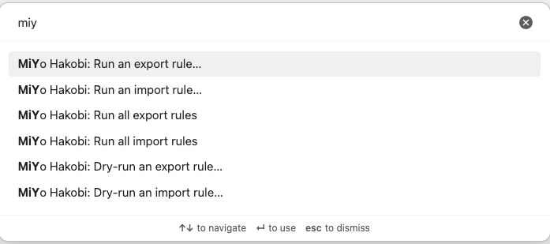

# Commands

Hakobi registers exactly six commands in Obsidian's command palette. Open the palette with `Cmd/Ctrl + P`, then type `Hakobi` to filter:

  

| Command | Behavior |
|---------|----------|
| `Run all import rules` | Fires one immediate tick for every import rule that is `enabledOnThisDevice` on the current device. |
| `Run an import rule…` | Opens a fuzzy picker of import rules. Pick one to fire one immediate tick. The picker lists every import rule, regardless of `enabledOnThisDevice` — so you can run a disabled rule one-shot without enabling it. |
| `Run all export rules` | Same as above, for export rules. |
| `Run an export rule…` | Same as above, for export rules. |
| `Dry-run an import rule…` | Like `Run an import rule…`, but writes audit entries with `would-*` decisions instead of touching files. |
| `Dry-run an export rule…` | Same, for export rules. |

## In-flight behavior

If you invoke `Run …` while the **same rule** is already running, the second invocation is no-op'd and a `Rule already running` notice appears. There is no queueing in v0.1.

You **can** invoke `Run all import rules` while one specific import rule is running — the running rule is skipped, the others fire. Each rule has its own in-flight slot.

## Disabled rules + one-shot runs

The "Run an … rule…" picker lists every rule on the current device, including those with `enabledOnThisDevice: false`. This is intentional — it lets you "test this rule once" without flipping the toggle. After the one-shot run, the rule remains disabled (no scheduled timer is started).

## Scope of "Run all"

`Run all import rules` and `Run all export rules` only fire rules that are **enabled on this device**. They are deliberately **not** "ignore the toggles and run everything." If you want to run a disabled rule, use the per-rule picker.

## Audit log entries

Every command-triggered run produces audit entries identical to a regularly scheduled run — the source of the tick (timer / `Run now` / command palette) is not recorded. The audit log shows the run happened; the cadence does not show up unless you correlate timestamps.
