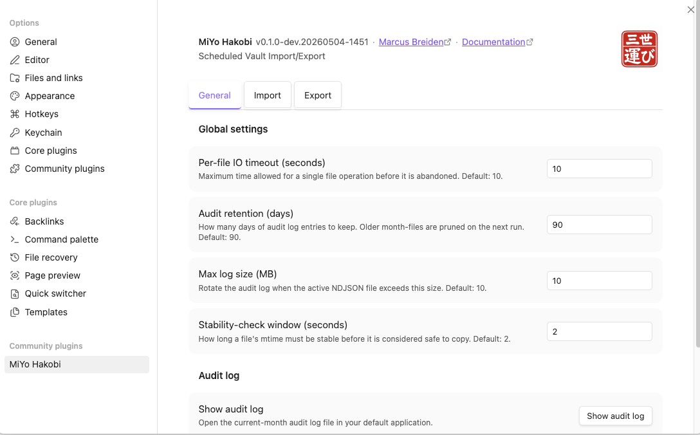
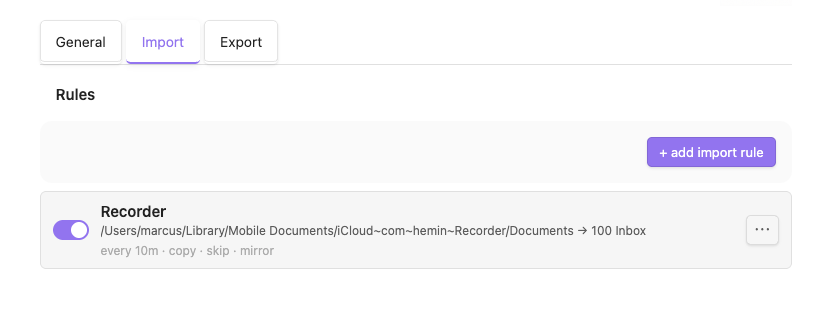
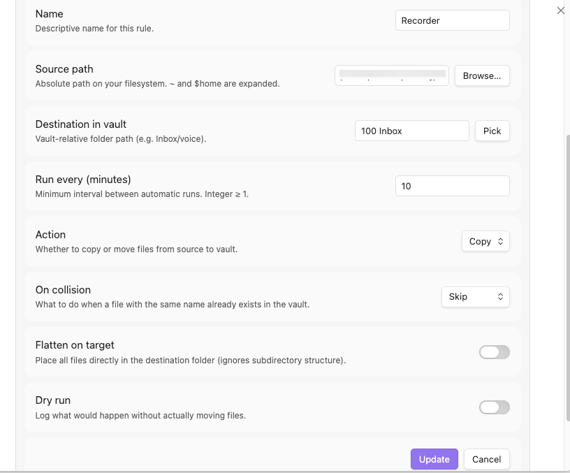
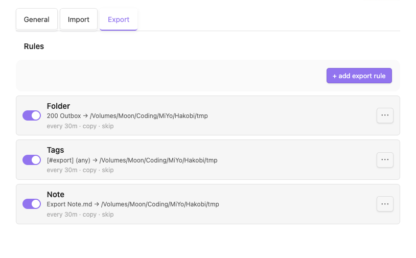
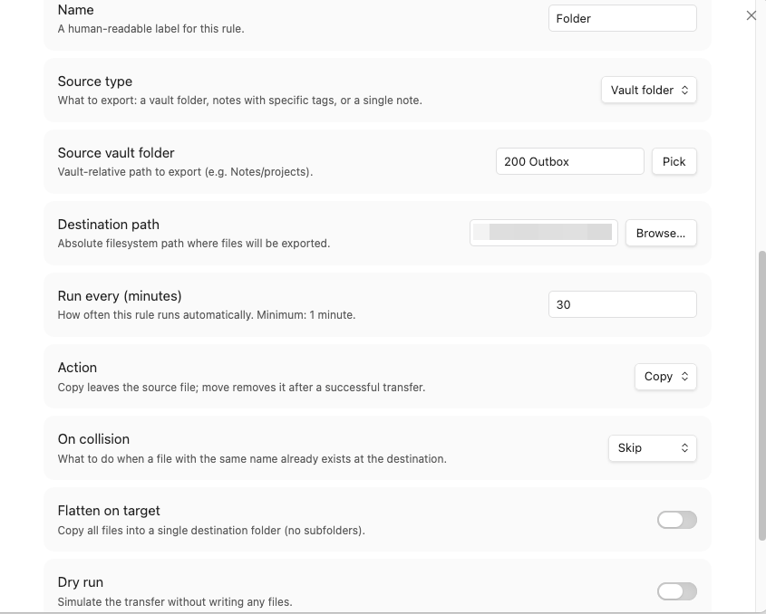
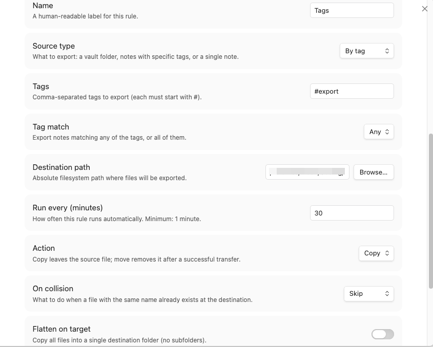
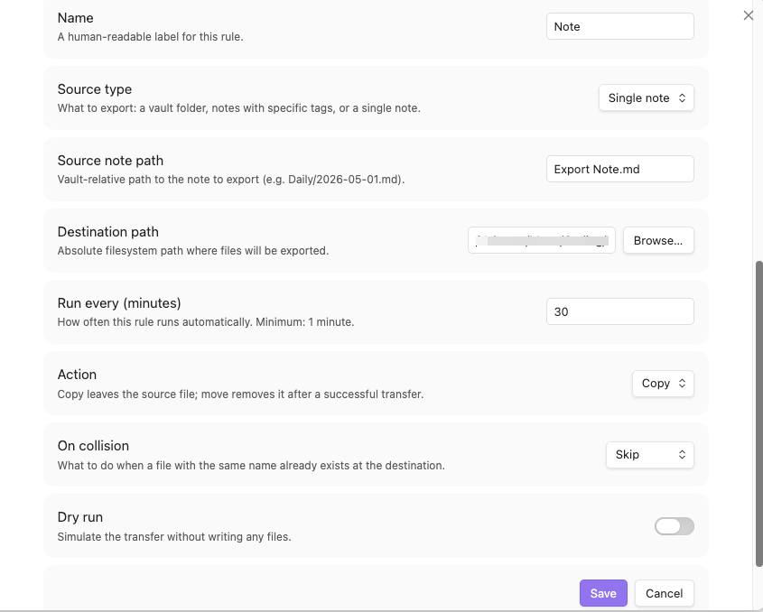
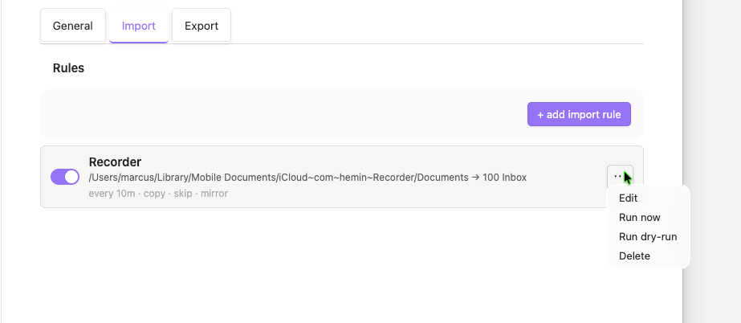

# Configuration Guide

Settings live under **Settings → MiYo Hakobi**. The panel has a fixed header (plugin identity + hanko seal) and three subtabs: **General**, **Import**, **Export**.

For installation, see [Installation](installation.md). For ready-made rule recipes, see [Example Configurations](example-configs.md).

## General subtab

  

| Setting | Default | Description |
|---------|---------|-------------|
| Per-file IO timeout (ms) | `10000` | Applies to every per-file read/write across all rules. Increase for slow paths (NAS, large cloud-sync placeholders). |
| Audit retention (days) | `90` | NDJSON files older than this are pruned at the next rotation check. |
| Audit max size (MB) | `10` | Per-file cap. Once exceeded, the file rotates and a new monthly file starts. |
| Stability check window (ms) | `2000` | How long an import-source file's `mtime` must stay unchanged before Hakobi picks it up. Prevents picking up half-written files. |
| **Show audit log** button | — | Opens the **current month's** `YYYY-MM.ndjson` file in your OS default app for `.ndjson`. There is no in-tab viewer. |
| **Purge audit log now** button | — | Deletes every NDJSON file under the audit directory. Requires explicit confirmation in a dialog; writes a single post-purge marker entry to a fresh log. |

## Import subtab

Pulls files from a local FS folder into a vault folder.

### Populated list

  

### Inline rule editor

Clicking **+ Add import rule** or **Edit** in a rule's overflow menu replaces the row with an inline editor (no modal).

  

| Field | Type | Notes |
|-------|------|-------|
| Name | text | Free-form. Shown in command palette pickers and audit log. |
| Source path | absolute FS path | Folder picker resolves via Electron's `dialog.showOpenDialog`. |
| Destination vault folder | vault-relative | Vault folder picker. Cannot be vault root, `.obsidian/`, or Hakobi's own data dir. |
| Every (minutes) | integer ≥ 1 | The scheduling cadence. Each rule has its own timer. |
| Action | `copy` \| `move` | Move deletes the source after a successful write. |
| On collision | `skip` \| `suffix` | `skip`: leave existing files alone. `suffix`: append `-1`, `-2`, … to the new file. |
| Flatten on target | toggle | When on, ignores subdirectories and writes all files into the destination root. |
| Dry run | toggle | Hakobi computes decisions and writes audit entries (`would-write`, `would-skip`, `would-suffix`) without touching files. |

## Export subtab

Pushes vault content out to a local FS path. Same row + editor shape as Import, with three source-type variants.

  

### Source types

| Type | Source | Behavior |
|------|--------|----------|
| `folder` | A vault subtree | Recursive. Mirrors structure unless **Flatten on target** is on. |
| `tag` | One or more tags | `tagMatch: any` (union) or `all` (intersection). All matching notes are exported. |
| `note` | A single vault note | One note → one destination file. |

### Rule editors

The export rule editor adapts to the chosen source type. The fields above the source row (Name, Every minutes, Action, On collision, Flatten on target, Dry run) are shared across all three; the source row itself changes shape.

**Folder source** — pick a vault subtree.

  

**Tag source** — pick one or more tags with `any` (union) or `all` (intersection) match.

  

**Note source** — pick a single vault note.

  

## Per-rule overflow menu

Each rule row has a `⋯` button on the right with four actions:

  

| Item | Effect |
|------|--------|
| Edit | Replaces the row with the inline editor for in-place editing. |
| Run now | Schedules an immediate run of this rule (ignoring its `everyMinutes` timer). No-op'd if a run is already in flight. |
| Run dry-run | Same as Run now, but writes `would-*` audit entries instead of touching files. |
| Delete | Asks for confirmation, then removes the rule + its per-device flags. |

## Per-device toggle

Every rule has a per-device enable toggle (the `✓`/`✗` switch on the left of each row). This is the single most-likely-to-confuse aspect of Hakobi — see [Per-device enablement](per-device.md) for the full explanation.

## Status bar indicator

Once at least one rule is enabled, a status-bar indicator (kanji 運) appears in Obsidian's status bar.

| State | Color | Tooltip |
|-------|-------|---------|
| `idle` | neutral | `Hakobi: idle` (or `Hakobi: idle — last run: 
`) |
| `running` | accent | `Hakobi: running '<rule name>'…` |
| `failed` | error | `Hakobi: failed — 
` (sticky until next successful run, or until you click) |

Clicking the indicator opens the General subtab. Clicking while in `failed` also clears the failure marker — your acknowledgement.

## Next steps

- [Example Configurations](example-configs.md) — common setups
- [How it works](how-it-works.md) — architecture, scheduler, audit log
- [Audit log](audit-log.md) — format, retention, allowlist
- [Per-device enablement](per-device.md) — why your synced rule didn't run
